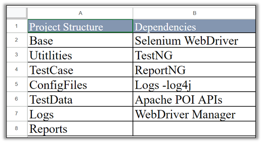
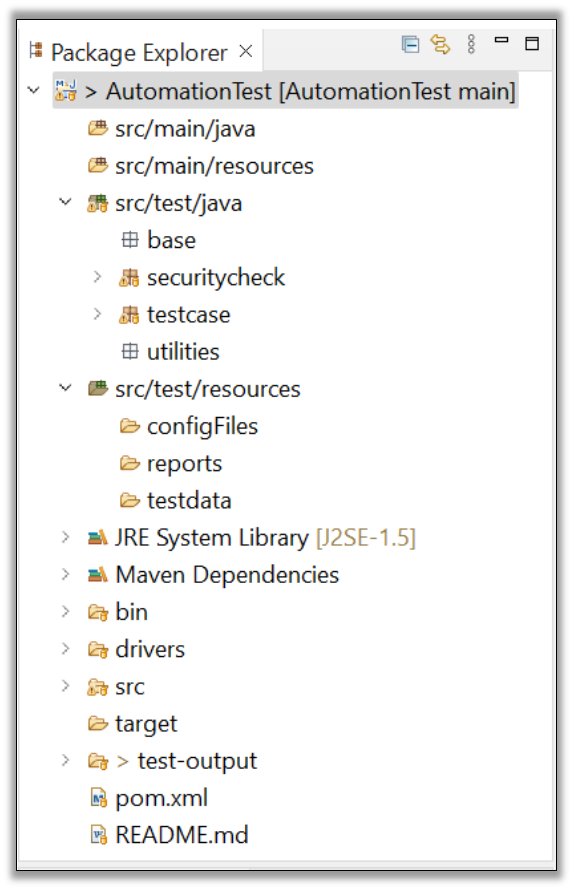
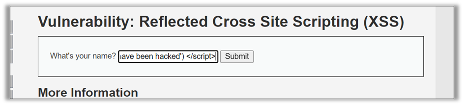

# AutomationTest
Java Library to faciliate atomation testing using selemnium


## Getting Started
These instructions will get you a copy of the project up and running on your local machine for development and testing purposes. See deployment for notes on how to deploy the project on a live system.

### Prerequisites
What Software you need to install to run this project

```
Installing Java development toolkit (JDK) eclipse 
Installing XAPP to run the DVAW
Installing DVWA and set it up and change the setting to enable all the database setup
TestNg Framework was installing inside the JDK environment  

```
### Designing and implementation


 <ins> planning the design instructures as follow</ins>




 <ins>After implemnting the design will be as follow</ins>
 



### The Setup

<ins>The following steps were applied to setup</ins>


<ins>Watch the setup video </ins>

[](https://www.youtube.com/watch?v=5MQOK7xD0O0 "Watch the video")

## Running the tests

Explain how to run the automated tests for this system
run the automation testcase</br>

</br>
 Assert if the page is XSS vulnerable </br>


</br>
 Asserting echo command in command injection vulnerabilty</br>
</br>

</br>


same assertion but the command echo was missing</br>

</br>


</br></br>


### Break down into end to end tests

Explain what these tests test and why
End-to-end testing is a functional tese, that examine the test from beginning to the end. It is evaluate the wepapplication all the way from the biginning to the finish.
```
-Type the URL into the address bar to launch the Gmail login page.
-Log into the account with valid credentials.
-Access Inbox. Open Read and Unread emails.
-Compose a new email.
-Reply to and forward an existing email.
-Open the Sent items folder. Check emails there.
-Open the Spam folder. Check emails there.
-Log out of Gmail by clicking ‘logout’.
```

### And coding style tests

Explain what these tests test and why

```
SecUtils.assertXSSVulnerable(driver);
SecUtils.isAlertPresent(driver);
SecUtils.assertXSSVulnerable(driver, massege);
SecUtils.assertXSSVulnerable(driver, "There is a trace that this page is XSS vulnerable");
SecUtils.assertVulnerable(driver, SecUtils.XSS, SecUtils.low);
SecUtils.assertXSSVulnerablelevel(driver,SecUtils.low);
SecUtils.isPasswordChanged(findtext);
SecUtils.vulnerableUrl(driver, findtext);
CSRFVulnerableFormExist(WebDriver driver, String filePath)
SecUtils.SecUtils.assertCMDIvulnerable(driver,ip);// assert IP command
SecUtils.assertCMDIechovulnerable(driver,"you have been hacked");//assert echo command
SecUtils.isCMDIPresnets(driver, "hacked");
SecUtils.CMDIetcpasswodVulnerabilty(driver, injection);
SecUtils.CMDIwhoamiVulnerabilty(driver, expectedResult);
SecUtils.assertSQLVulnerable(driver, "ID: a' OR 1=1 #");
SecUtils.assertCSPVulnerable(driver);
```


## License

This project is licensed under the MIT License - see the [LICENSE.md](LICENSE.md) file for details

## Acknowledgments

